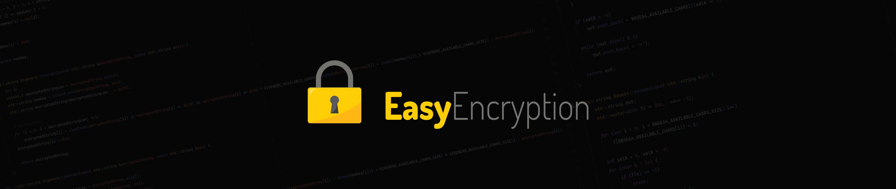

[](https://www.cplusplus.com/doc/oldtutorial/)
[](https://github.com/philipperemy/easy-encryption/actions/workflows/windows-cmake.yml)
[](https://github.com/philipperemy/easy-encryption/actions/workflows/linux-cmake.yml)
[](https://github.com/philipperemy/easy-encryption/actions/workflows/macos-cmake.yml)

# Easy Encryption
A very simple standalone C++98 library to obfuscate/deobfuscate strings based on Base64 and Vigenere cipher (Symmetric cipher).

**DISCLAIMER: This encryption is NOT secure and can be used as a "cheap way" to obfuscate some messages in a communication channel. If you need a solid and unbreakable encryption, please use a widely adopted standard and well researched cipher like AES-GCM.** You can find more information there: [pyca](https://github.com/pyca/cryptography).

It works as follows:
- Alice encodes in Base64 the message, then uses the Vigenere private key to encrypt the message.
- The encrypted message is sent through an unsecured channel.
- Bob gets the message and decrypts it with the Vigenere private key, and then decodes it with Base64.

Diagram summary:
___
**Message -> Base64 ENCODE -> Vigenere ENCRYPT -> Encrypted Message -> Vigenere DECRYPT -> Base64 DECODE -> Message**
___

The reason why we apply Base64 encode **BEFORE** Vigenere is because it's very easy for somebody to apply a Base64 decode and see about the structure of the message. For example, if we send `{"hello":123}`, an attacker can sniff the message, Base64 decode the message and get `{"qsggn":ygf}`. Of course the attacker still needs the Vigenere cipher key, but at least, he can get a pretty clear idea that JSON format messages are sent in the communication channel. The way to avoid this is to encode first in Base64 then encrypt it with the Vigenere key. If the attacker tries to Base64 decode first, it will see a random string of weird characters.

## API

### C++
- **Header** _(Always include this when you want to encrypt/decrypt something.)_
```c++
#include "<path>/EasyEncryption.h"
```

- **Encrypt message**
```c++
std::string EasyEncryption::encrypt(const std::string &encryptedString, const std::string &key)
```

- **Decrypt message**
```c++
std::string EasyEncryption::decrypt(const std::string &encryptedString, const std::string &key)
```

### Python

- **Encrypt message**
```python
wrapper.encrypt(message, key): returns encrypted message
```

- **Decrypt message**
```python
wrapper.decrypt(encrypted_message, key): returns decrypted message
```

## Compilation and execution
To compile this project, just add the files that are inside the "src" into your project, then give import to them and the magic happens!

## Python wrapper
To run it in Python, you need to compile the example that is located in "examples/application.cpp".
```bash
python3 wrapper.py
```